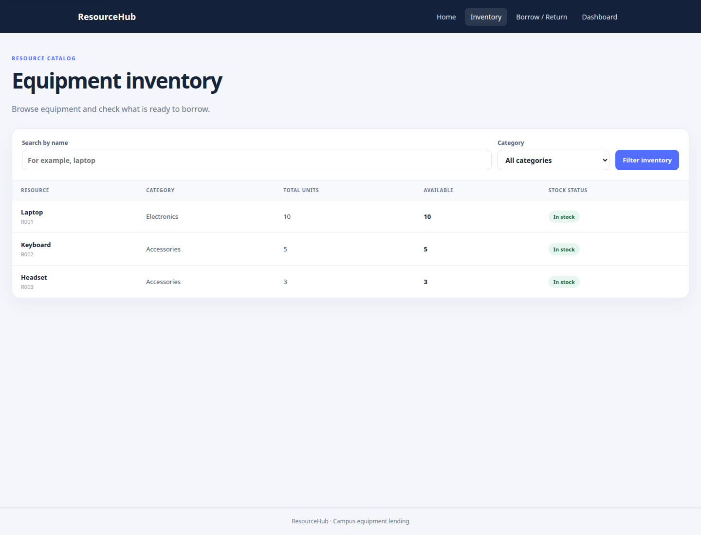
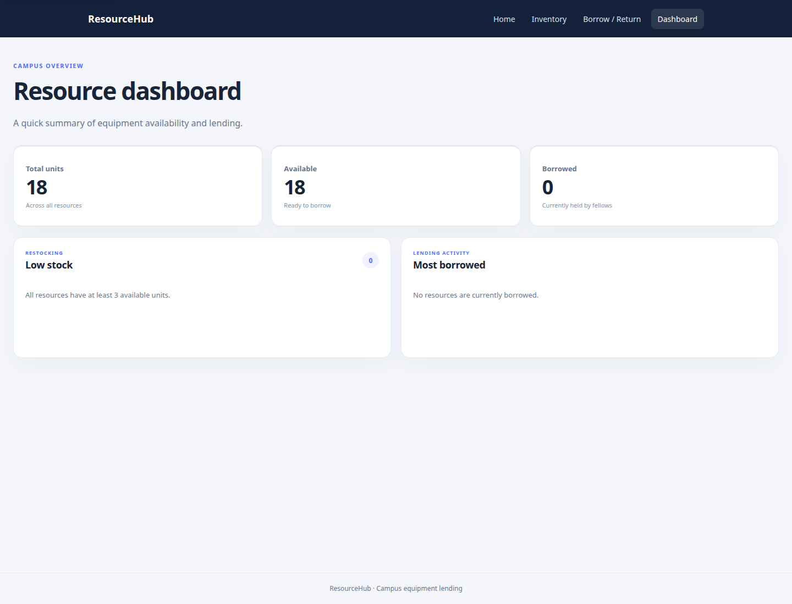

# ResourceHub

ResourceHub is a campus equipment lending project. The command-line program
uses Python's standard library and SQLite. A separate Flask website provides
an inventory, borrow and return forms, and a dashboard.

## Screenshots

### Inventory



### Dashboard



## Run the command-line program

```sh
python3 main.py
```

SQLite saves data in `campus_resources.db` in the directory where you start
the program. A new database starts with sample resources and fellows. Loans are
due in 14 days by default; reports include overdue items and the fellow holding
them. Choose **Export report to CSV** to create `report.csv`.

## Run the Flask website locally

From the project folder, create and activate a virtual environment:

```sh
python3 -m venv .venv
source .venv/bin/activate
```

On Windows PowerShell, activate it with:

```powershell
.venv\Scripts\Activate.ps1
```

Install the packages and start the website:

```sh
python -m pip install -r requirements.txt
python app.py
```

Open <http://127.0.0.1:5000>. Stop the server with **Ctrl+C**. The Flask
website uses the same `campus_resources.db` as the command-line program, so
run it from the project folder to use the project's database.

For a stable CSRF session key, set `RESOURCEHUB_SECRET_KEY` before starting
the app. Generate a value with:

```sh
python -c "import secrets; print(secrets.token_hex(32))"
```

Then set that value in your shell as `RESOURCEHUB_SECRET_KEY`. Keep it private
and do not commit it. If it is not set, the app makes a temporary random key;
forms can stop working after the server restarts.

For example, on macOS or Linux:

```sh
export RESOURCEHUB_SECRET_KEY="paste-your-generated-value-here"
```

In Windows PowerShell:

```powershell
$env:RESOURCEHUB_SECRET_KEY = "paste-your-generated-value-here"
```

## Deploy a demo on Render

1. Push this project to a GitHub or GitLab repository.
2. In Render, create a **New Web Service** and connect that repository.
3. Choose the free instance type.
4. Set **Build Command** to `pip install -r requirements.txt`.
5. Set **Start Command** to `gunicorn app:app`.
6. Add an environment variable named `RESOURCEHUB_SECRET_KEY`. Generate a
   private value with the command above and paste it into Render's environment
   settings. Do not put the value in this README or source code.
7. Create the service. When deployment finishes, open its `onrender.com` URL.

**Important for this project:** Render's free web service has an ephemeral
filesystem. The SQLite database file can be lost when the service restarts,
deploys again, or spins down after inactivity. Use the free Render deployment
as a demo with sample data only; it is not suitable for keeping real lending
records. Keeping records requires changing the app to use a persistent database
or hosting it with persistent storage. Render's free web services can also take
a short time to wake after sitting idle.

The deployment commands follow Render's [official Flask deployment guide](https://render.com/docs/deploy-flask).
See Render's [free instance details](https://render.com/docs/free) for current
limits and storage behavior.

## Tests

Run the command-line unit tests with:

```sh
python3 -m unittest
```
